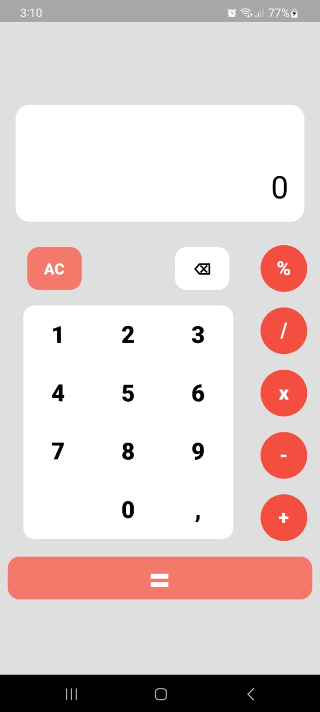
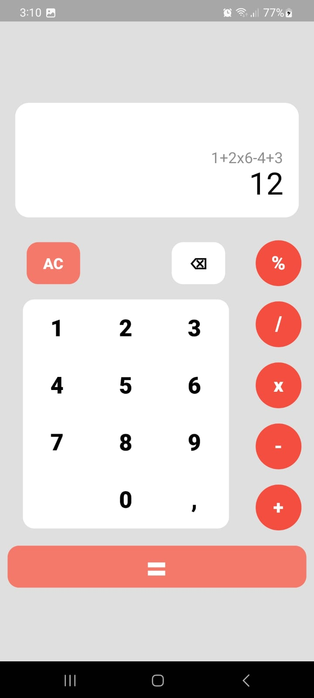
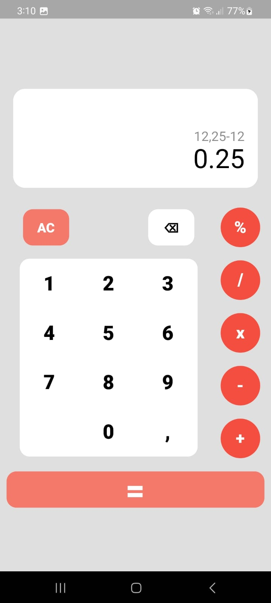

# Calculator App With Flutter Bloc

This project shows how to implemet a calculator app in Flutter, I'm using Flutter_bloc 8.1.2 and math_expressions 2.3.1 for the math calculations

# Runnig the project

1. Clone the repository

2. Open the project in your preferred IDE.

3. Run the app on an emulator or physical device.

# Packages
-[flutter_bloc](https://pub.dev/packages/flutter_bloc)
-[math_expresions](https://pub.dev/packages/math_expressions)

# Feature Roadmap
- Add local calculator history 
- Add scientific calculator page
